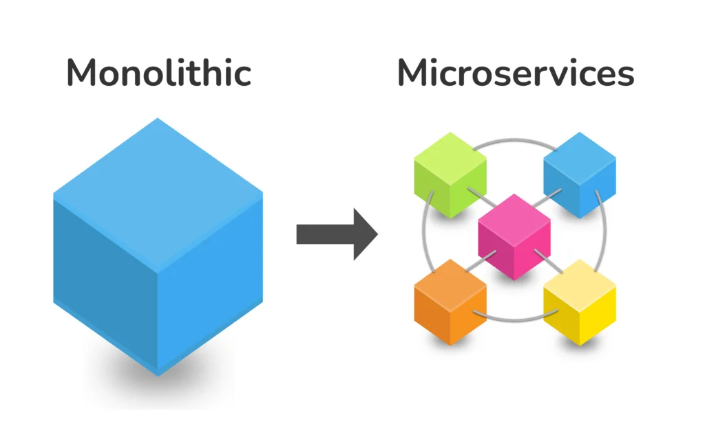

- **Name:** Tiffany

- **Student ID:** 2802503791

- **Class:** B4CC / L4CC

Article about Web Application Development and Security:
# Microservices
Microservices is a software architecture style that structures an application as a collection of small, independent, loosely coupled services, each focusing on a specific business capability, communicating via APIs, and deployable separately, offering agility, scalability, and easier maintenance compared to monolithic apps, though it introduces complexity in management. Each service has its own codebase, data, and dependencies, allowing small teams to develop and update them quickly without affecting the entire system, making them ideal for cloud-native development.

## Monolithic VS Microservices

**Monolithic app**
- One codebase
- One deployment
- One failure can take everything down
- Simple at first, painful later

**Microservices**
- Many services
- Each can live, die, or scale independently
- More moving parts, more power

## What is a microservice, concretely?

A microservice usually includes:

- Its own codebase
- Its own database (important!)
- A clear API contract
- A narrow responsibility